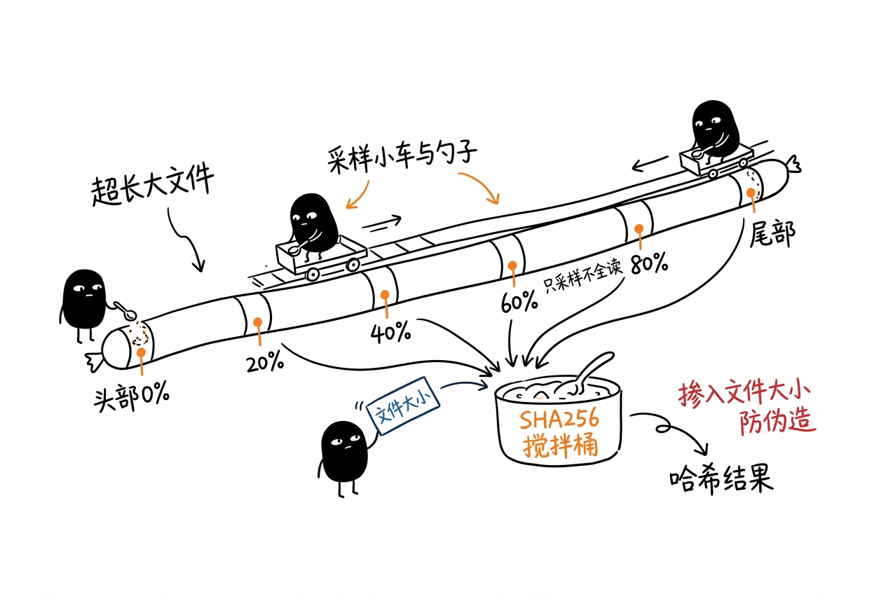
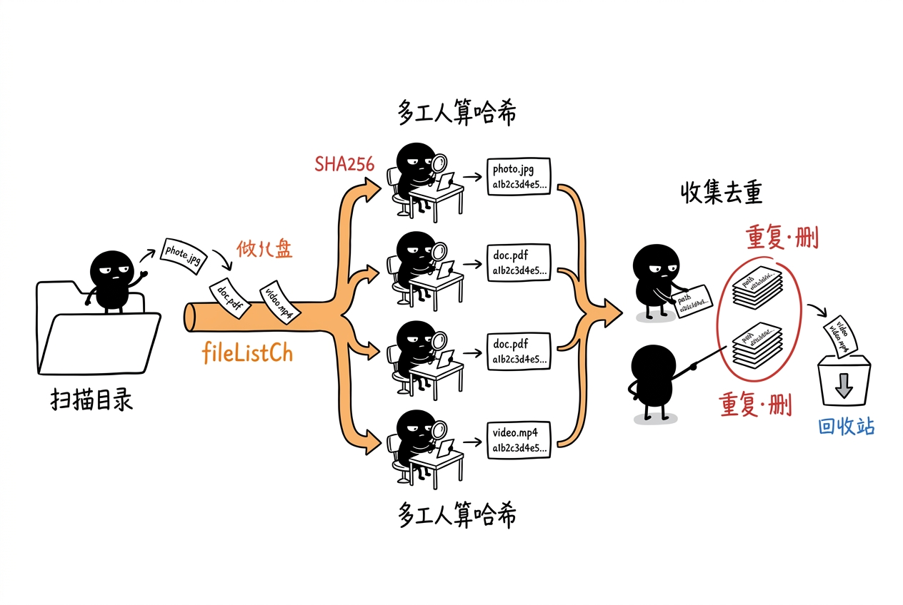
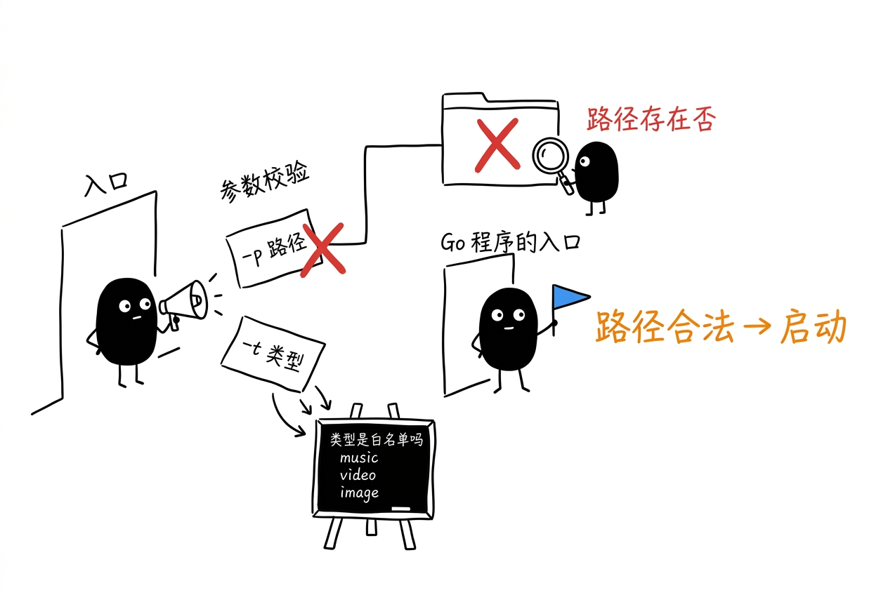
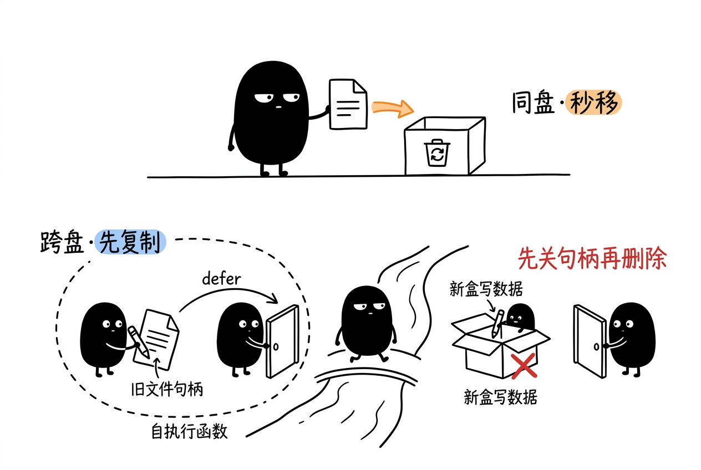
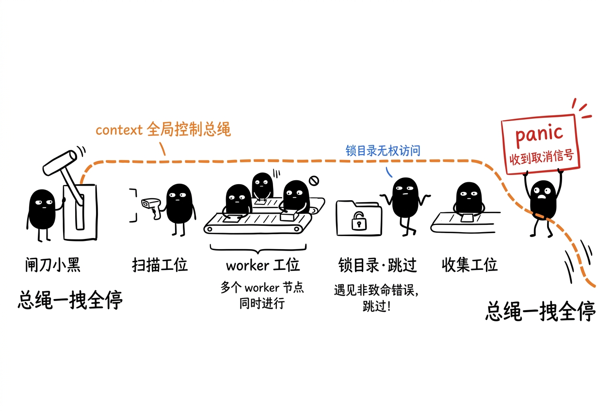

# File Duplicate Remover (FDR)

一款基于 Go 语言的交互式重复文件清理工具，通过 SHA-256 哈希算法定位重复文件，并提供命令行交互界面让你安全地选择要清理的文件。

## 功能特性

- **智能文件分类** — 内置音乐、视频、图片三大类共 60+ 种常见文件后缀，按类型精准扫描
- **SHA-256 哈希去重** — 小文件全量哈希保证精确，大文件采用多点采样策略平衡性能与准确度

### 哈希计算策略

- **小文件（≤ 5MB）**：直接全量读取计算 SHA-256，保证绝对精准。
- **大文件（> 5MB）**：不读全量，而是在文件的 `0% / 20% / 40% / 60% / 80% / 尾部` 共 6 个采样点各读 64KB，并额外注入文件大小参与哈希。这样即使有人刻意伪造内容，只要大小不同，哈希就绝对不同，兼顾性能与准确度。


- **高并发流水线架构** — 基于扇出/扇入模型，自动根据 CPU 核数分配 Worker 数量
- **交互式选择删除** — 通过 `promptui` 终端 UI 逐组展示重复文件详情，由你决定保留哪一个
- **安全回收站机制** — 被删除的文件不会直接销毁，而是移动到项目目录下的 `FDRTrashes/` 回收站，按类型和日期归档
- **跨盘文件移动** — 自动检测同盘/跨盘场景，同盘使用 `os.Rename`，跨盘自动回退到流式复制+删除
- **优雅的取消控制** — 基于 `context.Context` 实现全局取消传播，扫描或处理过程中随时中断
- **权限容错** — 遇到无权访问的系统目录自动跳过，不中断整体扫描流程

## 技术架构

```
┌───────────────────────┐
│       walkDir()       │
│      (Producer)       │
└───────────┬───────────┘
            │
            │ fileListCh (chan string, buf: 200)
            │
      ══════╪═════
            │ Fan-Out (N = NumCPU)
     ┌──────┼──────┐
     │      │      │
     v      v      v
   ┌─┴─┐  ┌─┴─┐  ┌─┴─┐
   │ 1 │  │ 2 │  │ 3 │  ... x N
   └─┬─┘  └─┬─┘  └─┬─┘
     │      │      │
     └──────┼──────┘
            │
            │ workerOutCh (chan FileInfo)
            │
      ══════╪═════
            │ Fan-In
            ▼
┌───────────┴───────────┐
│   OperateDuplicate()  │
│  Collect + Interactive│
└───────────────────────┘
```

**核心设计模式：**

| 模式 | 应用场景 |
|------|---------|
| 生产者-消费者 | `walkDir` 生产文件路径 → `Worker` 消费并计算哈希 |
| Worker Pool | `NumCPU` 个固定数量的协程并发处理 |
| Pipeline 流水线 | 扫描 → 哈希 → 收集 → 交互删除，阶段间通过 channel 连接 |
| 构造函数 | `NewFileDuplicateRemover()` 封装初始化逻辑 |



## 快速开始

### 环境要求

- Go 1.25+
- Windows / Linux / macOS

### 构建

```bash
# 克隆项目
git clone <repo-url>
cd FileDuplicateRemover

# 构建二进制
go build -o fdr.exe main.go
```

### 使用方式

```bash
# 扫描音乐文件中的重复项
fdr.exe -p "F:\歌曲" -t music

# 扫描视频文件
fdr.exe -p "D:\电影" -t video

# 扫描图片文件
fdr.exe -p "C:\Users\Photos" -t image
```

### 参数说明

| 参数 | 说明 | 必填 |
|------|------|------|
| `-p` | 需要扫描的目标文件夹路径 | ✅ |
| `-t` | 文件类型：`music`（音频）、`video`（视频）、`image`（图片） | ✅ |



### 交互操作

扫描完成后，工具会按组展示重复文件：

1. 每组重复文件以列表形式呈现，显示文件名、路径、大小、修改时间
2. 使用 **上下箭头** 选择你想删除的文件副本
3. 按 **回车** 确认删除
4. 被删除的文件会自动备份到 `FDRTrashes/<类型>/<日期>/` 目录下

```
👀 扫描完成！共扫描了 128 个文件, 发现 3 组重复文件
2026-07-27 15:04:05 选择一个待删除的文件并按下回车键
> 霍元甲-周杰伦.mp3
  路径: F:\歌曲\霍元甲-周杰伦.mp3
  大小: 5.23 MB
  修改时间: 2024-01-15 10:30:00
```

## 支持的文件类型

| 类型 | 后缀 |
|------|------|
| **music** | `.mp3` `.flac` `.wav` `.m4a` `.aac` `.ogg` `.wma` `.ape` `.alac` `.amr` `.opus` `.mp2` `.mid` `.midi` `.w64` 等 |
| **video** | `.mp4` `.avi` `.mov` `.mkv` `.flv` `.f4v` `.rmvb` `.rm` `.wmv` `.webm` `.ts` `.m3u8` `.mpg` `.mpeg` `.vob` `.3gp` `.m4v` 等 |
| **image** | `.jpg` `.jpeg` `.png` `.gif` `.webp` `.heic` `.heif` `.avif` `.bmp` `.tiff` `.svg` `.ico` `.cr2` `.cr3` `.nef` `.arw` `.dng` 等 |

## 回收站机制

删除的文件不会被永久销毁，而是被移动到项目运行目录下的安全位置：

```
FDRTrashes/
├── music/
│   └── 20260727/
│       ├── 霍元甲-周杰伦.mp3
│       └── ...
├── video/
│   └── 20260727/
└── image/
    └── 20260727/
```

如需恢复文件，直接从对应日期目录中将文件移回原位置即可。

### 跨盘移动的实现细节

被删文件默认用 `os.Rename` 同盘秒移；当源文件与目标回收站分属不同磁盘时，自动回退为「流式复制 + 删除原文件」。这里有个易踩的坑：若不在删除前先关闭新旧两个文件句柄，Windows 会报"资源未释放"导致删除失败。代码用**自执行函数**让 `defer` 的关闭动作早于 `os.Remove` 执行，从而安全释放资源。



## 取消控制与容错

基于 `context.Context` 实现全局取消传播：扫描、Worker、收集各阶段都监听同一个 ctx，任一环节 `panic` 或收到取消信号，都会通过 `cancel()` 把"总绳"一拽，让所有协程同时停下，不残留僵尸 goroutine。同时，遇到无权访问的系统目录会自动 `SkipDir` 跳过，个别单文件读取失败也只跳过该文件，不中断整体扫描。



## 依赖

| 依赖 | 用途 |
|------|------|
| [promptui](https://github.com/manifoldco/promptui) | 终端交互式选择界面 |

## License

MIT
